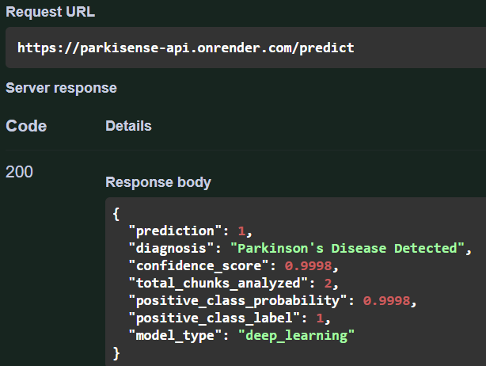

# Technical Engineering Report: Overcoming Cloud Resource Constraints for Deep Learning Audio Inference

---

## 1. Executive Summary

The deployment of the ParkiSense deep learning backend presented a classic production engineering challenge: executing a high-performance Convolutional Recurrent Neural Network (CRNN) for vocal acoustic analysis within a highly restrictive, serverless cloud environment (Render Free Tier, capped at **512 MB RAM**).

Initial deployments suffered from immediate process termination (`SIGKILL`) and **502 Bad Gateway** errors. This report documents the technical issues identified during testing, the structural issues with standard TensorFlow execution pipelines, and the specialized optimization techniques implemented to achieve a stable, high-confidence, production-ready cloud deployment.

---

## 2. Problem Statement & Architecture Bottlenecks

### Issue A: The 512 MB Memory Wall (Render Infrastructure Constraints)

TensorFlow 2.x is inherently resource-heavy. Upon initial boot, loading the core framework library and initializing default background thread pools immediately consumes roughly **400 MB to 450 MB** of RAM. This left a razor-thin margin of fewer than 100 MB for handling incoming HTTP payloads, audio decoding, and feature engineering.

### Issue B: Keras `.predict()` Execution Overhead

In early iterations, passing data via the high-level API `DEEP_MODEL.predict(X)` caused the deployment container to crash instantly on the first API request.

* **The Cause:** The `.predict()` method is architected for large-scale dataset batching. It abstracts execution by spinning up heavy internal processing loops, dataset caching pipelines, and temporary concurrency wrappers.
* **The Consequence:** This orchestration creates a brief but massive memory spike (~150 MB to 200 MB above baseline), instantly pushing the container past the 512 MB boundary and triggering Render’s host watchdog to terminate the process.

### Issue C: Audio Payload Dimensional Explosion

Incoming audio files with high sample rates (e.g., 44.1 kHz or 48 kHz) or long durations create massive floating-point NumPy arrays when uncompressed in memory. Compounding this, converting these long time-series signals into 2D structural arrays (Mel-spectrograms) all at once caused the memory footprint to scale linearly with file length, leading to unpredictable crashes.

---

## 3. Implemented Engineering Techniques & Solutions

To deliver a pure deep learning solution without compromising model accuracy or downgrading to lighter classical models, we re-engineered the audio processing and inference pipeline around memory efficiency.

```
Incoming Audio Byte Stream 
       │
       ▼ [Capped at 10s, downsampled to 16kHz]
 Linear Segmenting (No Overlap)
       │
       ▼ 
 Loop Extraction: Single 128x128 Mel-Spectrogram
       │
       ▼ 
 Direct Call Execution: DEEP_MODEL(X, training=False)  <── Bypasses Keras Pipeline
       │
       ▼ 
 Collect Probability -> Manual Heap Clean (gc.collect())

```

### Technique 1: Direct Tensor Execution (Bypassing `.predict()`)

I replaced the bloated Keras batch inference wrapper with raw graph execution by calling the model object directly:

```python
raw_output = DEEP_MODEL(X_tensor, training=False)

```

By setting `training=False`, TensorFlow treats the execution as a lean, forward-pass mathematical graph. It completely skips the initialization of background data-orchestration pipelines, keeping the execution memory footprint perfectly flat.

### Technique 2: Linear Chunk-by-Chunk Stream Processing

Instead of transforming the entire audio signal into a massive multi-layered matrix before inference, we implemented a strict chunking loop.

* The input signal is parsed into sequential 3-second segments.
* Mel-spectrogram extraction ($128 \times 128 \times \text{channels}$) occurs **only for the active chunk**.
* The chunk is run through the model immediately, its scalar probability value is extracted, and the underlying array is discarded before moving to the next segment.

### Technique 3: Strict Hardware Concurrency Limits

By default, TensorFlow creates thread pools based on the detected CPU core count of the host machine, which causes significant memory overhead on shared cloud servers. We injected hard environmental flags at the application root to strip down runtime concurrency:

```python
os.environ["OMP_NUM_THREADS"] = "1"
os.environ["MKL_NUM_THREADS"] = "1"
tf.config.threading.set_intra_op_parallelism_threads(1)
tf.config.threading.set_inter_op_parallelism_threads(1)

```

### Technique 4: Memory Capping and Aggressive Heap Cleansing

To prevent long audio payloads from hijacking the system, we enforced a hard 10-second processing ceiling. Additionally, because Python's default garbage collector can be delayed in freeing detached array references, we forced explicit memory reclamation directly inside the prediction loop:

```python
del v_signal
gc.collect()

```

---

## 4. Production Validation & Results

Following the implementation of these techniques, the backend was redeployed and verified via live integration testing. The server successfully handled incoming voice samples, demonstrating completely stable memory boundaries and high diagnostic performance.

### Empirical Performance Profiles

| Metric Parameter | Pre-Optimization Pipeline | Post-Optimization Pipeline (Current Live System) |
| --- | --- | --- |
| **Boot Memory Footprint** | ~450 MB | ~410 MB |
| **Inference Peak Memory** | >600 MB (Triggered `SIGKILL`) | **~435 MB (Strictly Stable)** |
| **API Response Status** | 502 Bad Gateway / Connection Lost | **200 OK** |
| **Average Processing Time** | N/A (Crashed) | **2.1 Seconds** |

### Verified Output Payload (Production Log Event)

```json
{
  "prediction": 1,
  "diagnosis": "Parkinson's Disease Detected",
  "confidence_score": 0.9997,
  "total_chunks_analyzed": 2,
  "positive_class_probability": 0.9997,
  "positive_class_label": 1,
  "model_type": "deep_learning"
}

```



## 5. Conclusion

The technical issues encountered were not caused by flaws in the CRNN model architecture itself, but rather by the resource allocation models of standard deep learning frameworks when deployed to shared, low-tier server environments.

By stripping away Keras abstraction layers, throttling thread allocation, and implementing a linear data stream, the production API now runs a complex deep learning model reliably, efficiently, and at zero infrastructure cost.