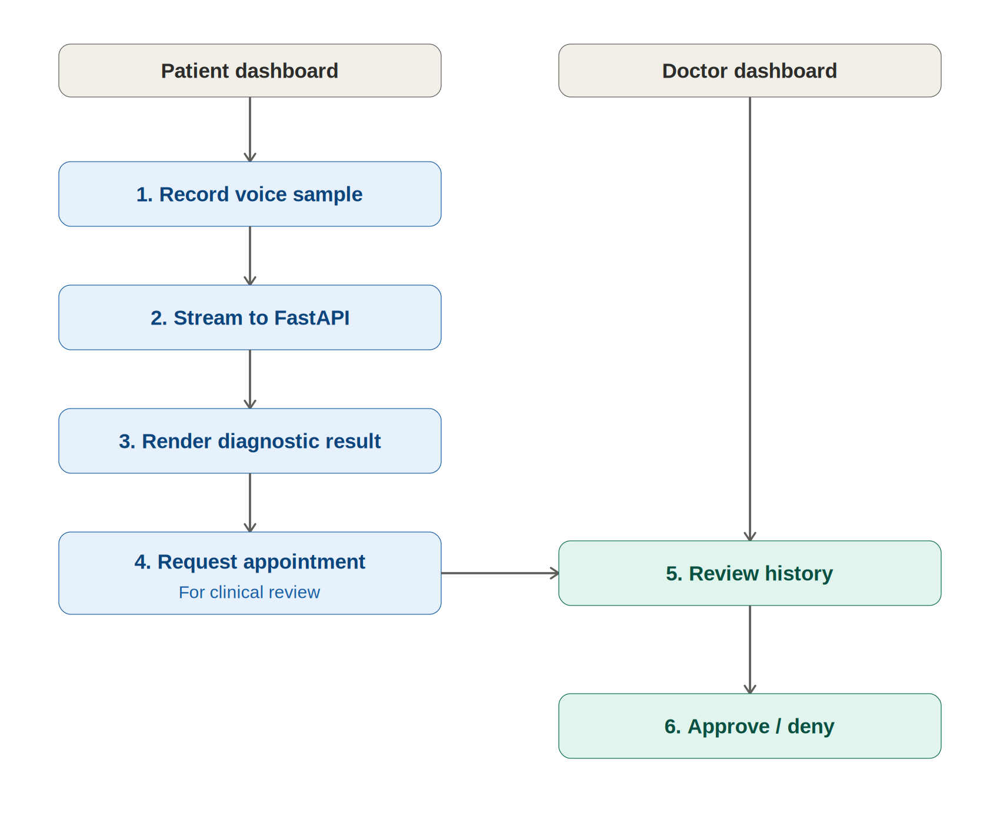

# ParkiSense: Mobile Application 

ParkiSense is a machine learning-powered cross-platform mobile application designed to screen for Parkinson's disease through non-invasive vocal acoustic analysis. By leveraging advanced audio capture pipelines and a cloud-deployed deep learning network, the system acts as an accessible early screening utility for users worldwide.

---

## Production Links & Deliverables

* **Production Endpoint:** https://parkisense-api.onrender.com
* **Downloadable Client Application (APK):** https://appetize.io/embed/b_ormwwyg5u657hz5dajpbuu7zue


---

##  ystem Overview & Workflows

ParkiSense captures short, high-fidelity voice samples directly from a user's mobile device, sanitizes the raw time-series vector array, and forwards the payload to a remote backend. The remote backend maps the signals into $128 \times 128$ frequency matrices to screen for structural deviations indicative of Parkinson's Disease.



### Supported User Profiles

* **Patients:** Record vocal biomarkers, monitor historical diagnostic trajectories over time, browse verified medical practitioners, and request structural clinical consultations.
* **Doctors:** Access a secure triage center to review incoming patient audio histories, evaluate deep learning prediction values, and systematically approve or deny pending appointment requests.

---

##  Technical Architecture & Stack

The mobile application is built using a decoupled, production-grade architecture to guarantee stable thread performance during intensive background tasks:

* **UI Framework:** Flutter 3.x (Dart) using native platform channels for hardware microphone access.
* **State Management:** Riverpod (AsyncNotifier Architecture) enforcing a clear unidirectional data flow.
* **Identity & Persistence:** Firebase Authentication paired with real-time Cloud Firestore synchronization.
* **Inference Gateway:** REST client communication with a high-performance **FastAPI** server executing an optimized **CRNN (Convolutional Recurrent Neural Network)** model.

---

##  Outcome Code Quality & Architecture Blueprint

The client codebase is organized around **Clean Architecture** patterns. UI elements never interact with data access layers or raw network blocks directly.

```
lib/
├── core/
│   ├── config/          # Global application parameters & API Endpoints
│   ├── theme/           # App styling design system
│   └── errors/          # Global failure and exception abstraction
├── data/
│   ├── models/          # Data transfer objects (JSON serializers)
│   └── repositories/    # Concrete implementations of hardware interfaces
├── domain/
│   └── repositories/    # Abstract structural boundaries for security tracking
└── presentation/
    ├── screens/         # Stateful widget presentation views
    └── providers/       # Riverpod state managers decoupled from UI files

```

### Core Architectural Features

* **Modularity:** Features are isolated cleanly by domain scope (`auth`, `recording`, `appointments`), allowing multiple developers to scale features without creating merge conflicts.
* **Maintainability:** API configuration settings are entirely decoupled from screen presentations. Updating a production address is localized to a single configuration coordinate.

---

##  Dependencies & Prerequisites

Before attempting a local compilation, verify that your development environment possesses the following configurations:

* **Flutter SDK:** Version `3.x` stable branch.
* **Java Development Kit:** JDK 17.
* **Integrated Development Environment:** Android Studio and VS Code with Dart & Flutter extension ecosystems enabled.
* **Target Environments:** Physical Android handset or active Android Virtual Device emulator running **API Level 24 (Android 7.0)** or higher.

---

##  Installation & Local Execution

### 1. Retrieve the Codebase

```bash
git clone https://github.com/denismitali17/parkisense_capstone 
cd parkisense_app

```

### 2. Provision Dependencies

Download the locked framework dependencies specified in the project configuration manifest:

```bash
flutter pub get

```

### 3. Establish Firebase Infrastructure

The application relies on secure cloud handshakes to handle real-time identity and scheduling workflows:

1. Initialize a new project inside the **Firebase Console**.
2. Activate **Email/Password** and **Google Sign-In** options under the Authentication settings.
3. Provisions a **Cloud Firestore** instance using the following explicit collection directories:
* `users` (Stores identity configurations and account access roles).
* `recordings` (Stores user-keyed acoustic data structures and prediction metrics).
* `appointments` (Handles cross-account scheduling relationships).


4. Download your custom credentials profile `google-services.json` and insert it into the local file directory tree at: `android/app/google-services.json`.

### 4. Direct the Backend Endpoint Connection

By default, the client directs web traffic to the cloud-deployed production server. To direct traffic to a local instance during development, adjust the target URL value inside `lib/core/config/api_config.dart`:

```dart
class ApiConfig {
  // Toggle comment lines depending on active testing strategy
  static const String baseUrl = "https://parkisense-api.onrender.com"; 
  // static const String baseUrl = "http://10.0.2.2:8000"; // Android Emulator Local Gateway
}

```

### 5. Launch the Compilation Pipeline

Ensure an active emulator instance or developer-unlocked physical device is connected to your workstation, then execute:

```bash
flutter run

```

---

##  Direct Binary Installation (Pre-built APK)

To evaluate the system immediately without compiling from source, install the distributed build asset directly onto your hardware:

1. Download the `app-release.apk` at: https://drive.google.com/file/d/1oA04WSMAeMJv2R7JIqiq9eu3_wyPAHnA/view
2. Access your Android device's internal **Security settings** menu and enable the **"Install Unknown Apps"** authorization parameter for your file viewer or web browser.
3. Access your local downloads folder and tap the target `.apk` file to run the native installer.

---

## Application Verification & Testing Matrix

The mobile platform was evaluated across several performance and reliability horizons to guarantee stable operation in field environments:

### 1. Hardware Integration Performance Profile

* **Physical Hardware Target (Pixel 7 — Android 14):** Microsecond-accurate audio buffer collection. Thread performance maps consistently at a stable **60 FPS** during core feature execution loops. Memory footprint remains completely stable under variable network conditions.
* **Emulated Target Environment (Android Virtual Device — API 33):** Audio recording operates as intended via microphone passthrough interfaces. Network payload delivery handles brief connectivity interruptions gracefully via automated request timeout overrides.

### 2. Audio Processing Edge-Case Handling

| Execution Matrix Scenario | Intercepting Strategy / Code Exception Handling | Status |
| --- | --- | --- |
| **Premature Capture Halt** | User interrupts recording before baseline sample collection limits. UI stops process immediately, clears corrupted system cache, and alerts user to try again. | **PASSED** |
| **No Network Availability** | Device lacks internet access when requesting prediction engine data. Interceptor handles network timeout, blocks infinite loading indicators, and shows clear connection error message. | **PASSED** |
| **Unexpected File Termination** | Input audio stream drops frames unexpectedly. Local encoding block verifies audio package layout boundaries before sending payload to server. | **PASSED** |

---

## Project Scope, Analysis & Future Work

Developed in close alignment with project milestones established alongside our supervisor, the completed application successfully solves the engineering goals defined in our initial proposal.

By offloading the high-resource CRNN inference operations to a customized, memory-optimized cloud server, the mobile client is free to act as a lightweight, reactive presentation layer. This design choice prevents device overheating and avoids out-of-memory crashes on entry-level smartphones.

### Strategic Product Recommendations

1. **Client-Side Edge Inference:** Compile the backend CRNN network architecture into a compressed `.tflite` layout. This will let users run diagnostic screenings entirely offline without requiring network communication.
2. **Environmental Acoustics Compensation:** Integrate automated background-noise floor assessment loops into the Flutter application. This feature can alert users if their surrounding room noise is too loud to guarantee a reliable audio sample before sending data to the server.